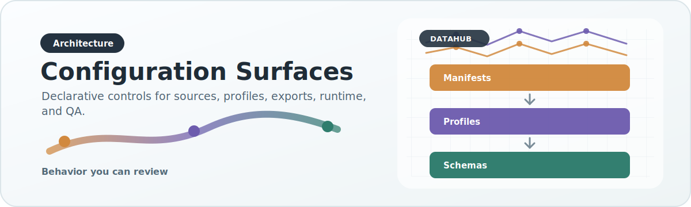

# Configuration Surfaces

{ .doc-visual }

DataHub has multiple configuration families because different problems require different declarations.

## 1. Prep profiles

Location:

- `config/prep_profiles/`

Purpose:

- arbitrate raw source columns into prepared intermediate columns
- define ancestry column mappings
- set defaults for missing raw values

Use when:

- the raw file is structurally irregular
- the source must be normalized before canonical ingest

## 2. Dataset profiles

Location:

- `config/profiles/`

Purpose:

- define field-level validation policy by dataset modality
- decide which fields are required and how missing values are handled

Use when:

- you need to enforce modality-level data quality contracts

## 3. Source manifests

Location:

- `config/sources/`

Purpose:

- identify sources
- define adapter names
- capture source metadata, access mode, and default parameters

Use when:

- adding or cataloguing a new source
- wiring source defaults into configurable ingestion

## 4. Runtime profiles

Location:

- `config/runtime_profiles/`

Purpose:

- define how the same logical pipeline runs in different compute environments
- set paths, scheduler behavior, memory, threads, Slurm defaults, and step configuration

Use when:

- moving from laptop to AWS or HPC
- standardizing operational execution

## 5. Export manifests

Location:

- `config/export_manifests/`

Purpose:

- define the analyzed publication contract between unified data and published artifacts
- declare what fields are preserved, what is derived, and what reaches serving outputs

Use when:

- adding new analyzed metadata
- preserving provenance in published outputs
- introducing new derived fields with stable helper IDs

## Why these are not merged into one file

A single all-purpose config would create several problems:

- raw-column mapping would mix with runtime scheduler concerns
- serving/publication semantics would mix with source registry metadata
- validation policies would become dependent on operational deployment details

The current split is deliberate and should be preserved.
