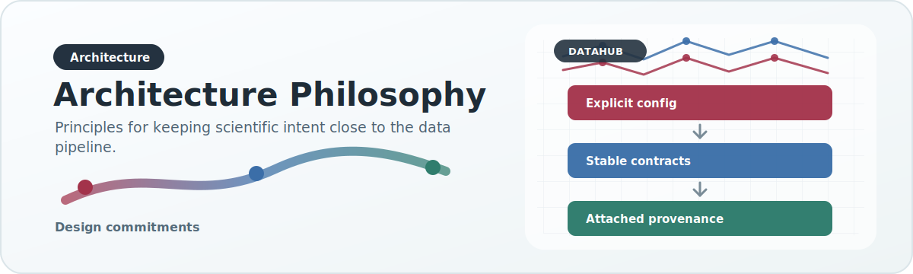

# Architecture Philosophy

{ .doc-visual }

This page explains why DataHub is structured the way it is.

## The core problem

Biomedical data integration fails when a system mixes these responsibilities together:

- raw-source parsing
- canonical modeling
- scientific interpretation
- runtime serving
- environment orchestration

When these concerns blur, every new source becomes expensive, every new chart forces a rewrite, and provenance gets lost.

## DataHub's answer

DataHub deliberately separates the problem into layers.

### Preparation is not publication

Raw preparation exists to stabilize dirty inputs. It should not decide final analyzed semantics.

### Canonicalization is not frontend shaping

Canonical records are the reusable scientific integration layer. They should not be contorted to one UI shape.

### Publication is where analyzed contracts become explicit

The publish layer is where canonical data is converted into analyzed artifacts. This is where backward compatibility, aggregated chart contracts, and public-serving decisions belong.

### Serving artifacts are downstream of publication

The serving DuckDB exists for runtime efficiency. It should preserve published semantics, not independently invent them.

## Why there are so many config surfaces

Different types of configuration solve different problems.

- Prep profiles: raw-column arbitration
- Dataset profiles: validation policy
- Source manifests: source identity and adapter defaults
- Runtime profiles: environment execution behavior
- Export manifests: what survives into analyzed artifacts and how derived fields are constructed

Keeping these separate is intentional. A single global config for everything becomes impossible to reason about.

## Why source-specific behavior belongs in adapters and overrides

DataHub is expected to scale to sources that disagree structurally and semantically. The sustainable pattern is:

- common reusable contract in the base layer
- source-specific deviations in narrow adapters or source overrides

This keeps common behavior common and isolates exceptional behavior.

## Why legacy compatibility exists but is constrained

HeartBioPortal still depends on legacy-compatible payloads, so DataHub must publish them. But compatibility is not allowed to own the architecture. The system is designed so newer artifacts, like a compact serving DuckDB, can coexist with legacy outputs until consumers migrate.

## Why provenance is a design principle, not a feature

For scientific credibility, provenance must survive normal operation. That means:

- preserving source identity
- avoiding unnecessary collapsing of source distinctions
- keeping additive metadata explicit instead of implicit in ad hoc naming or comments

This is why the export manifest layer exists.

## Why algorithmic semantics must be documented

In a repository like DataHub, many bugs are not syntax bugs or runtime failures. They are semantic bugs:

- counting rows when the intended unit is unique variants
- collapsing ancestry too early
- changing phenotype grouping behavior without recording why
- normalizing labels in a way that changes scientific interpretation

Those errors are expensive because they can still produce valid files and attractive charts while being analytically wrong.

So DataHub treats algorithmic semantics as part of the public architecture:

- the code implements the rule
- the tests prove the rule
- the docs explain the scientific rationale for the rule

That triad is necessary for outside contributors to change the repository safely.
