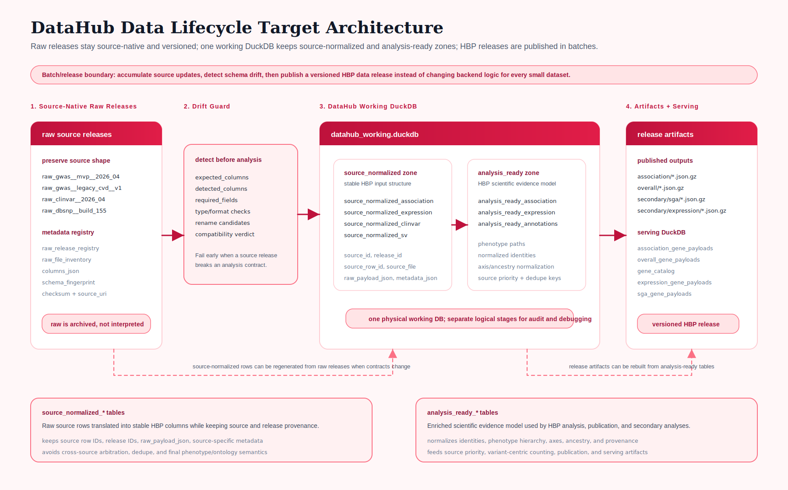

# System Overview

## End-to-end structure

```text
raw sources / exported files / APIs
  -> source-specific preparation
  -> source-specific adapters
  -> canonical records
  -> validation and enrichment
  -> unified DuckDB / Parquet
  -> analyzed publication (.json / .json.gz)
  -> serving DuckDB
  -> backend and web application
```

## Target lifecycle model

The long-term target is for DataHub to own the full HBP data lifecycle: ingesting or scraping source data, preserving source-native raw releases, translating source rows into stable HBP input schemas, building analysis-ready evidence tables, publishing analyzed artifacts, and producing serving databases for the backend.



### Source-normalized vs analysis-ready tables

These stages can live in the same physical working DuckDB. They should remain logically separate because they answer different questions.

The **source-normalized** layer is source-adjacent. It answers: "How do we express this source release in a stable HBP input schema?" Source-normalized rows should retain source identity, release identity, source row identity, file provenance, and source-specific leftovers such as `raw_payload_json` or `metadata_json`. This layer should not make final cross-source scientific decisions.

The **analysis-ready** layer is science-facing. It answers: "How should HBP reason scientifically about this evidence across sources?" This is where DataHub normalizes identifiers, phenotype paths, chart axes, ancestry labels, provenance semantics, and the keys needed for source-priority and variant-centric counting.

Raw releases can therefore remain source-native and versioned, while the working DuckDB provides stable logical stages needed to run HBP analysis in batches.

## Main architectural layers

### 1. Source-facing layer

This includes:

- source manifests
- adapters
- optional raw preparation profiles

Its purpose is to understand the quirks of each source without polluting the rest of the system.

### 2. Canonical modeling layer

This layer uses `CanonicalRecord` and validation contracts. It is the internal scientific lingua franca of DataHub.

### 3. Unified storage layer

This is where large-scale merged processing happens, especially in the DuckDB-first workflows. It is the working analytical source of truth.

### 4. Publication layer

Publishers create consumer-facing artifacts. In the current repository this mainly means:

- legacy-compatible analyzed JSON
- phenotype rollup outputs
- serving DuckDB artifacts

### 5. Orchestration layer

Scripts and runtime profiles decide how the same logical workflow runs on a laptop, AWS, or HPC.

## The most important distinction in the repository

There are two very different classes of artifacts:

### Working analytical artifacts

Examples:

- canonical DuckDB
- unified points tables
- Parquet exports

These are rich, operational, and not necessarily optimized for direct serving.

### Published analyzed artifacts

Examples:

- legacy-compatible `.json` / `.json.gz`
- compact serving DuckDB

These are consumer-facing and intentionally shaped.

Contributors should not confuse the two.

## Why the unified DuckDB-first path matters

The unified pipeline keeps integration at the point/raw layer. This matters because:

- source-priority dedup happens before publication
- phenotype grouping can use the full hierarchy
- provenance can be preserved before the data is collapsed into chart-oriented payloads
- serving artifacts can be rebuilt without repeating raw-source parsing
