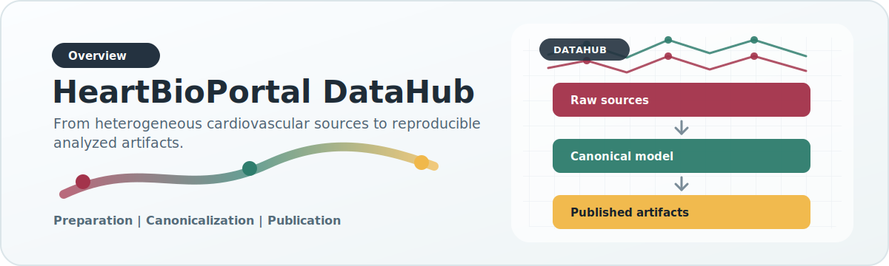

# HeartBioPortal DataHub

{ .overview-hero }

HeartBioPortal DataHub is the cardiovascular data engineering and publication layer behind HeartBioPortal. It exists to solve one problem cleanly: different biomedical sources all describe related biology, but they do so with different schemas, different semantics, different quality guarantees, and different operational constraints. DataHub provides the structure that turns those incompatible inputs into coherent, reproducible analyzed artifacts.

## What DataHub is responsible for

DataHub owns four responsibilities:

1. **Preparation**: bring irregular raw files into stable, auditable intermediate shapes.
2. **Canonicalization**: map heterogeneous sources into one reusable record model.
3. **Publication**: convert unified records into analyzed outputs that downstream systems can serve.
4. **Orchestration**: run the same logical pipeline on a laptop, a cloud VM, or an HPC cluster.

## What DataHub is not

DataHub is not the web application, not the long-term application database, and not a place to re-implement biological logic in multiple layers. The backend should consume artifacts created by DataHub. If business logic is needed to interpret raw data scientifically, it belongs here first.

## Reader map

Use the documentation based on what you need:

- New contributor: start with [Getting Started](getting-started.md) and [Repository Tour](repository-tour.md)
- Data engineer: read [System Overview](architecture/system-overview.md), [Configuration Surfaces](architecture/configuration.md), and [Unified DuckDB Pipeline](pipelines/unified.md)
- Scientist trying to understand the artifact model: read [Data Model](architecture/data-model.md), [Association Pipeline](pipelines/association.md), and [Serving Artifacts](pipelines/serving.md)
- Someone extending the platform: read [New Source Onboarding](extending/new-source.md) and [Export Manifest Framework](extending/export-manifests.md)
- Someone preparing a run: use [Local Smoke Test](runbooks/local-smoke-test.md) or [Release Checklist](runbooks/release-checklist.md)

## Core design commitments

- **One canonical model, many source adapters**
- **Publish once, serve many times**
- **Prefer explicit config over hidden source-specific conditionals**
- **Keep provenance attached as long as possible**
- **Keep legacy compatibility without freezing the architecture**

## High-level flow

{ .doc-visual }

```text
raw files / source APIs
  -> preparation profiles
  -> adapters
  -> canonical records / unified DuckDB points
  -> analyzed publication (.json/.json.gz)
  -> serving DuckDB
  -> backend / web application
```

## Current major pipeline families

- **Legacy-compatible association build**: direct publish from prepared/legacy inputs
- **MVP dataset-specific pipeline**: canonical ingest plus legacy-compatible publish
- **Unified DuckDB-first pipeline**: merged MVP + legacy points, source-priority dedup, publish from DuckDB, optional serving artifact build

The source catalog distinguishes `integrated` sources, which can create
canonical records today, from `catalog_only` sources, which document curated
future integration targets.

## Documentation website

This repository is configured as a MkDocs site published by GitHub Pages from
the GitHub Actions workflow in `.github/workflows/docs.yml`. For local preview
commands, see [Getting Started](getting-started.md).
