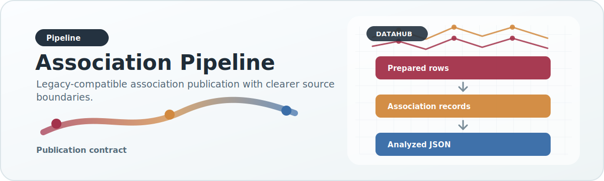

# Association Pipeline

{ .doc-visual }

This page covers the association-oriented path that produces legacy-compatible analyzed outputs.

## Inputs

Association inputs currently arrive from multiple paths:

- legacy aggregated CSVs
- legacy raw CVD / trait files
- MVP long-form aggregated phenotype files
- future association-like external sources through adapters

## The logical stages

### 1. Optional raw preparation

If a raw source is too irregular for direct adapter consumption, it first goes through a preparation profile.

Result:

- stable prepared rows
- auditable field arbitration from raw columns to a normalized intermediate schema

### 2. Canonical ingest

An adapter or ingest script maps the source into canonical records or a canonical DuckDB points table.

This is where source-specific parsing belongs.

### 3. Validation

Dataset contracts enforce minimum quality expectations:

- required fields
- missing-value policy
- exclusion or unknown-value handling for specific axes

### 4. Enrichment and normalization

Categorical axes, phenotype routing, and source-priority behavior are normalized here or immediately before publication.

Gene identifiers are also sanity-filtered before publication. DataHub does not publish analyzed outputs for rows whose `gene_id` is clearly not gene-like, such as bare numeric values that leaked in from malformed input rows or shifted columns. The current rule is intentionally permissive: a publishable `gene_id` must contain at least one letter.

### 5. Publication

The association publisher emits the legacy-compatible payload shape that the older HeartBioPortal stack expects.

This shape includes:

- phenotype-level association payloads
- overall gene-level payloads
- axes such as variation type, clinical significance, and most severe consequence
- ancestry payloads grouped by population label

## Scientific counting semantics

Association chart axes are **variant-centric**, not raw-row-centric.

That means the unit of counting for:

- variation type (`vc`)
- most severe consequence (`msc`)
- clinical significance (`cs`)

is the canonical `variant_id` / rsID for the published scope.

### Why this rule exists

The same biological variant can appear multiple times in upstream data because:

- the same rsID is reported by multiple sources
- the same rsID appears in repeated rows within one phenotype dataset
- the same rsID is observed across multiple ancestry rows
- the same rsID survives source-priority selection but still has repeated record representations before publication

If publication simply counts rows, the charts inflate category totals and stop representing unique variant evidence. That is scientifically misleading for category summaries such as variation type.

### Per-phenotype counting rule

Within a single published phenotype entry, DataHub first collapses records by `variant_id`.

If more than one record exists for the same variant inside that phenotype bucket, DataHub keeps the best representative record using the smallest available `p_value`.

After that representative selection step, `vc`, `msc`, and `cs` are counted once per variant.

### Overall gene-level counting rule

The overall payload is also variant-centric.

DataHub does **not** compute overall axis counts by summing already-aggregated phenotype counters. Instead, it re-evaluates the full gene record set, collapses by `variant_id`, selects the best representative record per variant, and then counts categories once per unique variant.

This prevents the same rsID from being counted repeatedly across phenotype buckets in the overall gene summary.

## Association and overall payload semantics

Association publication emits two related but different payload families:

```text
association/<DATASET_TYPE>/<GENE>.json.gz
overall/<DATASET_TYPE>/<GENE>.json.gz
```

`DATASET_TYPE` is usually:

- `CVD`
- `TRAIT`

The split is intentional. It preserves disease and trait provenance, makes
dataset filters cheap, and prevents the pipeline from mixing semantically
different phenotype groups too early.

### Association payloads

Association payloads are gene-based files whose contents are phenotype-level
records.

For CVD data, each record carries a disease label path:

```json
{
  "disease": ["cardiomyopathy", "dilated_cardiomyopathy"],
  "vc": [{"name": "SNP", "value": 12}],
  "msc": [{"name": "missense variant", "value": 4}],
  "cs": [{"name": "benign", "value": 2}],
  "ancestry": [
    {
      "name": "European",
      "data": [{"rsid": "rs123", "value": 0.14}]
    }
  ]
}
```

For trait data, the label key is `trait`:

```json
{
  "trait": ["blood pressure traits", "systolic_blood_pressure"],
  "vc": [{"name": "SNP", "value": 8}]
}
```

The phenotype names are therefore not encoded in the filename. They live inside
the JSON payload under `disease` or `trait`. A single gene file can contain many
phenotype records.

### Overall payloads

Overall payloads are gene-level aggregates for one dataset type:

```json
{
  "data": {
    "vc": {"SNP": 101},
    "msc": {"intron variant": 44},
    "cs": {"benign": 19},
    "ancestry": {
      "European": {"rs123": 0.14}
    }
  },
  "pvals": {}
}
```

The overall payload exists because the unfiltered first search result should not
have to reconstruct a gene-level aggregate at request time. It is a fast,
precomputed view that still follows the same variant-centric scientific rule:
deduplicate by `variant_id`, select the best representative record, then count.

For a default HBP search, the runtime can show:

- CVD overall from `overall/CVD/<GENE>.json.gz`
- trait overall from `overall/TRAIT/<GENE>.json.gz`
- a combined UI view if the frontend requests "all" and the backend has an
  explicit scientifically safe merge rule

The storage split does not require the UI to show CVD and traits as disconnected
experiences. It only keeps the underlying artifacts clean.

## Filtered aggregation semantics

Filtered charts must follow the same scientific counting rule as overall.

The input set changes:

```text
overall input
  -> all records for the gene and dataset type

filtered input
  -> records whose phenotype path matches the active filters
```

The aggregation rule must not change:

```text
select matching canonical records
  -> collapse by variant_id
  -> pick the best representative record, usually smallest p_value
  -> count vc, msc, and cs once per retained variant
  -> build ancestry by population and rsID
```

### Why naive count-summing is wrong

It is tempting to filter the already-published association records and sum their
`vc`, `msc`, and `cs` counters. That is not scientifically safe.

The same rsID can appear under multiple phenotypes. If a user selects "all CVD
except two diseases", summing the remaining phenotype counters can count the
same variant multiple times.

Therefore:

- default unfiltered charts may use `overall` for speed
- phenotype-filtered charts must not blindly sum association counters
- filtered aggregation must deduplicate by `variant_id`
- any backend helper that computes filtered totals must use the same algorithm
  as overall publication

### Current limitation

The current association JSON files preserve phenotype-level summaries and
ancestry rsID points, but the `vc`, `msc`, and `cs` fields are already
aggregated counters. Those counters alone are not enough to perfectly
reconstruct a deduplicated filtered aggregate for arbitrary filter sets.

For exact filtered aggregation, DataHub should add a compact filterable artifact
or table that preserves variant identity and the fields needed for aggregation.

Recommended future artifact:

```text
variant_index/CVD/<GENE>.json.gz
variant_index/TRAIT/<GENE>.json.gz
```

Recommended shape:

```json
[
  {
    "variant_id": "rs123",
    "phenotype_path": ["cardiomyopathy", "dilated_cardiomyopathy"],
    "variation_type": "SNP",
    "most_severe_consequence": "missense variant",
    "clinical_significance": "benign",
    "p_value": 1e-8,
    "ancestry": {"European": 0.14}
  }
]
```

This artifact would let the backend compute filtered charts correctly without
loading raw source rows or duplicating one artifact per possible filter
combination.

### Chart-specific artifacts

Chart-specific artifacts are useful only when they reduce payload size without
creating filter-state duplication.

Good candidates:

- one ancestry-focused artifact per gene and dataset type
- one compact variant-index artifact per gene and dataset type
- one source/provenance artifact per gene and dataset type, if provenance
  becomes too heavy for normal detail payloads

Poor candidates:

- one artifact for every selected phenotype combination
- one artifact per UI filter state
- precomputed combinations such as "all CVD except X"

The professional rule is:

```text
precompute stable scientific units
compute user-specific filter states from those units
```

### Ancestry semantics

Ancestry payloads remain rsID-keyed. Population maps are allowed to keep one point per variant per population label. This is different from chart-axis counting:

- chart axes answer: "how many unique variants fall into this category?"
- ancestry answers: "what per-variant population values are available?"

Those are intentionally different analytical questions.

## Axis normalization semantics

Association category axes are normalized before publication so equivalent source labels collapse into a coherent chart vocabulary.

Examples:

- `indel` and `INDEL` become `INDEL`
- `Missense_Variant` and `missense_variant` become `missense variant`
- list-like clinical significance labels are reduced to a canonical category using the configured priority order

This normalization is part of the analyzed scientific contract. It is not a frontend cleanup step.

## What publication intentionally does not preserve

The published `.json` / `.json.gz` outputs are analyzed artifacts, not a raw record dump.

They intentionally preserve:

- canonicalized phenotype-level summaries
- canonicalized overall summaries
- ancestry point payloads
- additive `_datahub` metadata

They intentionally do **not** preserve every raw row or every intermediate duplicate representation from upstream sources.

### 6. Serving artifact build

The serving builder can read the published outputs and create a compact DuckDB serving artifact. This is downstream of publication.

For large full-dataset builds, the serving builder streams payload rows into DuckDB in batches rather than collecting the entire association corpus in Python memory first. This keeps the artifact build operationally feasible on HPC and medium-memory servers without changing the analyzed contract.

If the published outputs were just regenerated from a clean canonical pipeline and no additional normalization is needed, the builder also supports a fast path through `--trust-published-payloads`. In that mode it stores published association/overall JSON text directly instead of reparsing and renormalizing every file. This is substantially faster, but it should only be used when those published outputs are already known to be canonical.

## Why publication is still needed even with DuckDB

The point of the publication stage is not just file creation. It is the point where DataHub defines the analyzed contract. The serving artifact should preserve that contract, not replace the meaning of it.

## Current additive metadata path

The association export manifest framework adds reserved `_datahub` metadata blocks to published outputs. These blocks are additive and allow the project to carry forward provenance and future coverage fields without breaking existing payload consumers.
