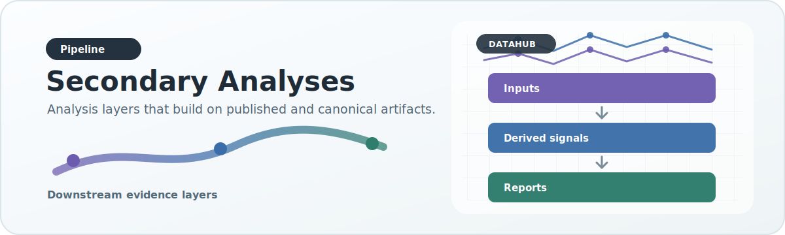

# Secondary Analyses

{ .doc-visual }

This page documents the secondary-analysis layer that sits downstream of the primary association pipeline.

## Why this layer exists

Not every consumer-facing payload is a primary source ingest.

Some artifacts are:

- imported side modalities such as expression
- derived post-association analyses such as shared genetic architecture (SGA)

Treating them all as ad hoc special cases inside the serving builder makes the system harder to reason about and harder to extend. The secondary-analysis layer gives them one explicit home.

## Design rule

Secondary analyses are downstream of the primary association contract.

That means:

- they should not redefine association semantics
- they should reuse cleaned canonical association identity where appropriate
- they should be generated or imported explicitly
- they should be attachable to an existing serving DB without rebuilding association tables

## Two analysis modes

### Imported

These analyses normalize an existing non-association source into a standard per-gene artifact shape.

Current example:

- `expression`

### Derived

These analyses are computed from the cleaned association layer after ingest, merge, and deduplication.

Current example:

- `sga`

## Config surface

Secondary analyses are declared under:

- `config/secondary_analyses/`

Current manifests:

- `config/secondary_analyses/expression.json`
- `config/secondary_analyses/sga.json`

These manifests declare:

- analysis ID
- version
- mode
- artifact subdirectory

## Runtime package

Core implementation lives in:

- `src/datahub/secondary_analyses/`

Important modules:

- `registry.py`
  - loads and validates secondary-analysis manifests
- `expression.py`
  - imports and normalizes expression payloads
- `sga.py`
  - derives SGA payloads from the unified association point store
- `artifacts.py`
  - reads and writes standardized secondary-analysis per-gene artifacts
- `serving.py`
  - applies secondary-analysis artifacts into an existing serving DuckDB

## Artifact shape

Secondary analyses publish standardized per-gene artifacts under:

- `secondary_root/final/<analysis>/genes/<GENE>.json.gz`

They also emit analysis metadata under:

- `secondary_root/final/<analysis>/metadata.json`

This keeps generation and serving-update concerns decoupled:

- BigRed can generate the secondary artifacts
- AWS can import those artifacts into the production serving DB

without rerunning the full association pipeline.

## Expression semantics

Expression is an imported secondary analysis.

The current source is the legacy:

- `expression.json`

The secondary-analysis runner converts it into the runtime per-gene payload the frontend already expects. No association semantics are changed here; this is normalization and packaging only.

## SGA semantics

SGA is a derived secondary analysis.

### Scientific meaning

The current SGA contract is:

- per gene
- per phenotype
- split into `cvd` and `trait`
- containing the rsIDs that are shared across at least one cross-type phenotype pair

This is intentionally downstream of the cleaned association layer. It means SGA inherits the same corrected:

- gene filtering
- phenotype normalization
- variant identity handling

instead of depending on a separate legacy preprocessing path.

### Current positional limitation

The cleaned unified association point store preserves `variant_id` / rsID identity, but it does not retain the old legacy genomic start/end coordinates that DataManager's historical SGA files stored.

To keep the existing frontend payload contract stable without reintroducing a parallel raw-data dependency, the current DataHub SGA secondary analysis encodes each shared rsID as a deterministic identity interval. This preserves exact shared-rsID overlap behavior for the existing chart contract.

This is an implementation detail for runtime compatibility. Scientifically, the SGA result is still interpreted as shared rsID identity across CVD/trait phenotype pairs.

## Protein-context semantics

Protein context is a derived secondary analysis for the splicing viewer.

The contract is:

- per gene
- per protein-coding isoform
- all feature coordinates expressed in amino-acid/protein coordinates
- Ensembl provides the transcript/translation backbone and translation-exon track
- EBI Proteins and InterPro add protein feature, domain, topology, and region annotations when a UniProt accession can be resolved

The generated artifact is intentionally separate from structural-variant genomic
exon backfills. SV exon data can help as a fallback, but the splicing viewer's
scientific axis is protein residue position, so the primary artifact must be
protein-coordinate and isoform-aware.

## Incremental serving updates

Secondary analyses are meant to update an existing serving DB in place.

That update path:

- replaces the requested secondary-analysis tables
- refreshes `gene_catalog`
- records update provenance in `secondary_analysis_metadata`

It does **not** rebuild:

- `association_gene_payloads`
- `overall_gene_payloads`

This is the intended production workflow when the primary association serving DB already exists.

## Operational workflow

### Generate on BigRed

Use:

- `scripts/dataset_specific_scripts/unified/run_secondary_analyses.py generate`

Typical pattern:

- derive `sga` from the corrected unified DuckDB
- optionally generate `expression` artifacts from an explicit source file
- generate `protein_context` from a variant-viewer root and API-backed protein annotations

For large SGA runs, the generator streams the cleaned association point store in gene order instead of materializing the full deduplicated result set in Python memory. This keeps memory bounded to one gene's phenotype/variant working set at a time and is the intended HPC execution mode.

For protein-context runs on BigRed, use the Slurm wrapper:

- `scripts/slurm/generate_protein_context.sbatch`

Submit it as a capped array job, for example `sbatch --array=0-31%4 ...`, so no more than four API-fetch partitions run at once.

Very large SGA runs should also be split into deterministic gene partitions:

- `--unit-partitions N`
- `--unit-partition-index I`
- `--duckdb-memory-limit`
- `--duckdb-temp-directory`

Each partition writes disjoint per-gene artifacts under the same `final/sga/genes/` directory and writes partition-specific metadata such as `metadata.part000of032.json`.

Do not use `--replace` inside parallel partition jobs. If the SGA artifact tree needs to be cleared, remove `final/sga/` once before submitting the partitioned Slurm jobs.

On HPC systems, set the DuckDB memory limit lower than the Slurm memory allocation and point `--duckdb-temp-directory` at scratch storage so DuckDB can spill rather than being killed by the scheduler.

### Apply on AWS

Use:

- `scripts/dataset_specific_scripts/unified/run_secondary_analyses.py apply`

Typical pattern:

- copy only the secondary-analysis artifact tree to AWS
- apply it into the existing serving DB
- keep `--log-level INFO` enabled for production applies; the command logs a durable progress line every `--progress-interval` artifact files and logs when the `gene_catalog` refresh starts and completes
- the apply is transactional: if a corrupt artifact or database error occurs, the target secondary table and `gene_catalog` update are rolled back instead of being left half-applied

This avoids copying the full unified DuckDB or rebuilding the full 400GB serving artifact from scratch.
