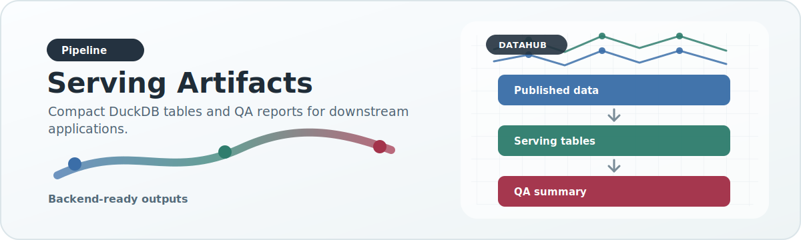
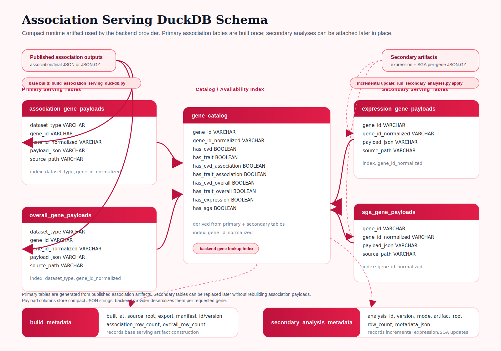

# Serving Artifacts

{ .doc-visual }

## Why serving artifacts exist

The raw or unified working DuckDB is not the same thing as a runtime-serving artifact.

The working store is optimized for:

- ingest
- merge
- deduplication
- analysis
- reconstruction of published outputs

The serving artifact is optimized for:

- compact read-only access
- predictable backend retrieval
- avoiding large in-memory Redis preloads

## Current serving artifact

The main serving artifact is a compact DuckDB database built by:

- `scripts/dataset_specific_scripts/unified/build_association_serving_duckdb.py`

It currently contains tables such as:

- `association_gene_payloads`
- `overall_gene_payloads`
- `association_summary_payloads`
- `overall_summary_payloads`
- `expression_gene_payloads`
- `sga_gene_payloads`
- `gene_catalog`
- `build_metadata`
- `secondary_analysis_metadata`



## Serving contract

The serving DuckDB contract is declared in:

- `config/output_contracts/association_serving_duckdb.json`

The contract names the primary runtime tables, required columns, query
expectations, and compatibility notes. The most important rule is that serving
payload JSON preserves published semantics; it does not reinterpret association
or overall payloads.

The summary tables are an API performance layer. They are derived from the full
published payloads by removing detail-heavy fields such as ancestry while
preserving the chart-count fields needed by the initial search view (`vc`,
`msc`, `cs`, and `pvals`). This keeps `/api/search_summary/` fast for very large
genes while leaving full payload tables available for detail endpoints.

Existing serving DBs can be upgraded in place with:

```bash
python3 scripts/dataset_specific_scripts/unified/upgrade_association_serving_duckdb.py \
  --db-path /data/DataHub/datamart/association_serving.duckdb \
  --batch-size 50 \
  --payload-source auto \
  --progress-interval 500
```

The upgrade is incremental and safe to rerun. By default, `--payload-source auto`
prefers the `source_path` JSON/JSON.GZ payload files recorded in the serving DB
and falls back to the existing DuckDB `payload_json` column when a source file is
not available. This keeps in-place upgrades memory-safe without forcing every
summary row to be read back from the very large serving DB blob column.

## Runtime loading algorithm

The HBP v3 backend uses a progressive loading model. The goal is to make the
first search result fast without throwing away the full scientific payloads
needed by detail charts.

The intended request flow is:

```text
gene search
  -> DuckDB gene_catalog lookup
  -> DuckDB summary payload lookup
  -> initial charts render from summary payloads
  -> detail endpoints load full JSON/JSON.GZ artifacts only when needed
```

The first lookup is small and index-oriented. The backend should not read a full
per-gene association JSON blob just to answer whether a gene exists or to draw
top-level `vc`, `msc`, `cs`, and `pvals` charts.

### Summary payloads

Summary payloads live in:

- `association_summary_payloads`
- `overall_summary_payloads`

They intentionally keep:

- phenotype label paths under `disease` or `trait`
- `vc`
- `msc`
- `cs`
- `pvals`
- additive `_datahub` metadata when available

They intentionally omit detail-heavy data such as ancestry. This omission is
not scientific data loss. It is a serving optimization for the first screen.
The full payload remains available through the published JSON/JSON.GZ artifact.

### Detail payloads

Detail payloads are used for later-loading charts, such as ancestry. They can be
served from either:

- full `payload_json` values inside `association_gene_payloads` and
  `overall_gene_payloads`
- the JSON/JSON.GZ artifact recorded in each row's `source_path`

For production-scale artifacts, DataHub should prefer the second mode whenever
possible. Reading a single very large DuckDB `VARCHAR` blob can be slower and
more memory-heavy than resolving the artifact path and reading the corresponding
compressed JSON file directly.

### Slim serving DB mode

A slim serving DB keeps DuckDB as the catalog and summary index while avoiding
duplicated full JSON blobs.

In slim mode:

- `gene_catalog` remains in DuckDB
- summary tables remain in DuckDB
- secondary-analysis serving tables can remain in DuckDB
- full association and overall rows keep `dataset_type`, `gene_id`,
  `gene_id_normalized`, and `source_path`
- full association and overall rows may set `payload_json` to `NULL`

This avoids storing the same full payload twice:

```text
published JSON/JSON.GZ artifact
  + duplicated full payload_json inside DuckDB
```

Instead, DuckDB acts as a release index:

```text
DuckDB row
  -> dataset_type
  -> gene_id_normalized
  -> source_path
  -> published artifact
```

The HBP backend can then read summary data from DuckDB and read full data from
the artifact path only when a detail endpoint needs it.

### Source-path remapping

DataHub build jobs often run on HPC paths, while production serving runs on AWS
paths. Therefore, a consumer may need to remap a stored `source_path` suffix onto
the production artifact root.

Example:

```text
stored source_path:
/N/scratch/kvand/hbp/analyzed_data_unified/association/final/association/CVD/TTN.json.gz

production artifact root:
/data/DataHub/analyzed_data/association_new/final

resolved runtime path:
/data/DataHub/analyzed_data/association_new/final/association/CVD/TTN.json.gz
```

The stable part is the path below `final/`:

```text
association/CVD/TTN.json.gz
overall/TRAIT/TTN.json.gz
```

Runtime consumers should treat that suffix as the portable artifact identity.

### Why not only stream one giant JSON response?

HTTP streaming can help network delivery, but it does not solve the main
runtime problem if the backend must still:

- read one giant JSON blob
- allocate it in memory
- parse the entire object
- serialize the entire response
- force the browser to parse everything before most charts need it

The preferred design is to load by use case:

```text
summary endpoint
  -> summary payload only

detail or ancestry endpoint
  -> full/detail artifact only when needed
```

Chart-specific artifacts can be added later, but they should represent stable
scientific modules, not every possible UI filter state.

## Important design rule

The serving builder is downstream of publication.

That means:

- it should preserve analyzed semantics defined by publication
- it should not become a second independent scientific transformation layer

The export manifest framework reinforces this rule.

Secondary analyses follow the same principle:

- primary association publication defines the base analyzed contract
- imported or derived secondary analyses can extend the serving artifact later
- those extensions should update only their own tables and serving metadata
- they should not silently rebuild or reinterpret association payloads

## Build metadata

The serving DB records the manifest ID and version used at build time. This allows debugging of:

- which analyzed export contract produced the artifact
- whether a runtime issue is due to artifact staleness vs code mismatch

Incremental secondary-analysis updates are recorded separately in:

- `secondary_analysis_metadata`

This distinguishes:

- base serving artifact construction
- later in-place attachment of secondary analyses such as expression and SGA

The serving builder can also write a DataHub QA report after the DB is built:

```bash
datahub-build-serving-duckdb \
  --input-root /data/hbp/analyzed_data_unified \
  --db-path /data/hbp/datamart/association_serving.duckdb \
  --qa-report-json /data/hbp/state/association_serving.qa.json
```

That report includes row counts for serving tables, the serving DB checksum,
published payload counts, and source-catalog integration status.

## Why this is better than Redis-only bulk load

A compact DuckDB serving artifact is:

- more portable
- less memory-heavy
- easier to version
- better aligned with DataHub's role as an artifact-producing platform

Redis can still exist as a cache or compatibility layer, but it should not be the only production story for large-scale analyzed outputs.

## Incremental secondary-analysis updates

If an existing serving DB already contains association and overall payloads, DataHub can now attach secondary analyses later without rebuilding the whole DB.

That flow is intended for cases such as:

- building the primary serving DB on BigRed
- copying it to AWS
- deriving or importing secondary artifacts later
- updating the production serving DB in place

The current incremental update surface is:

- `scripts/dataset_specific_scripts/unified/run_secondary_analyses.py apply`

See the dedicated secondary-analysis pipeline documentation for details.
