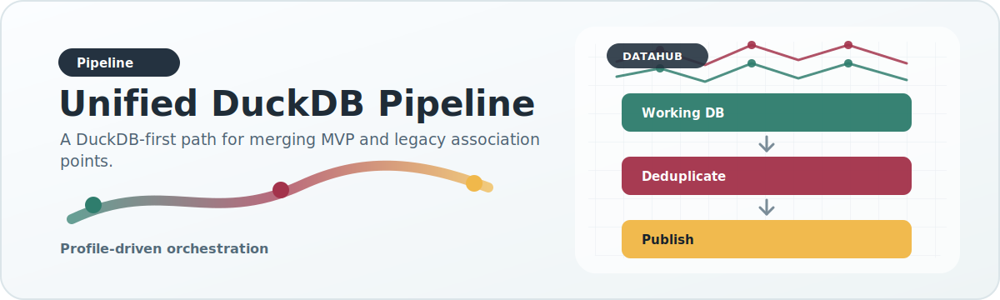

# Unified DuckDB Pipeline

{ .doc-visual }

The unified pipeline is the main large-scale integration path for merged MVP and legacy association data.

## Why this pipeline exists

The repository previously had a more fragmented story where different datasets or legacy paths could be processed independently. The unified pipeline exists so that:

- MVP and legacy data can be merged into one points table
- source-priority deduplication happens centrally
- publication can operate from a reproducible working store
- the same logical steps can run on a laptop, cloud VM, or HPC cluster

## Main scripts

- `scripts/dataset_specific_scripts/unified/manage_working_duckdb.py`
- `scripts/dataset_specific_scripts/mvp/ingest_mvp_duckdb_fast.py`
- `scripts/dataset_specific_scripts/unified/ingest_legacy_raw_duckdb.py`
- `scripts/dataset_specific_scripts/unified/publish_unified_from_duckdb.py`
- `scripts/dataset_specific_scripts/unified/run_unified_pipeline.py`
- `scripts/report_artifact_qa.py`

## Stages

### Working DuckDB lifecycle init

The profile-driven runner includes a `working_init` step before ingest and
publish when `--step all` is used. This initializes the lifecycle tables for
raw release registration, source-normalized association rows, schema drift
reports, and analysis-ready association rows in the configured working DuckDB.

This makes the target lifecycle model part of the normal path rather than a
separate migration-only utility. Existing ingest and publish steps continue to
use the shared association points table while the source-normalized and
analysis-ready zones mature.

### MVP ingest

This step ingests long-form MVP rows into a unified points table in DuckDB. It is optimized for scale and resumability.

Rows whose `gene_id` is not gene-like are rejected during ingest. Numeric leaks such as `0.799091` are treated as malformed identifiers, not valid genes.

### Legacy raw ingest

This step ingests historical raw CVD and trait files into the same points table schema.

The same gene-identifier sanity rule applies here. A row must have a non-empty `gene_id` containing at least one letter to enter the shared points table.

Legacy association files also rely on an explicit double-quote CSV policy during DuckDB ingest. Some CVD rows contain comma-bearing allele strings such as `\"['A', 'C']\"`. If quote handling is left to mis-detection, DuckDB can shift columns and turn allele-frequency fields into fake `gene_id` values. DataHub pins the quote character so those rows stay aligned.

### Unified publish

This step reads from DuckDB, applies source-priority deduplication, and publishes legacy-compatible analyzed outputs. It supports resumable unit processing and partitioned HPC execution.

Unified publish also re-applies the gene-identifier sanity filter before grouping work units. This backstops already-built DuckDB tables so malformed numeric `gene_id` values cannot become published filenames.

## Gene-boundary publication rule

The unified publisher is allowed to stream rows from DuckDB in chunks, but it is not allowed to finalize association chart counts at arbitrary row-batch boundaries.

Association publication has gene-level semantics:

- axis counts are deduplicated by `variant_id`
- overall counts are recomputed from the full gene record set
- phenotype-level summaries must see the complete canonical record set for that gene

Because of that, unified association publishing flushes outputs at gene boundaries rather than merely at record-count thresholds.

### Why this matters

If a gene is published in multiple incremental aggregated fragments and those fragments are merged later by summing counters, the same rsID can be counted more than once even when the intended scientific contract is variant-centric.

Operational chunking is acceptable. Semantic fragmentation is not.

## Best-record selection

When more than one canonical record competes for the same variant inside a published counting scope, DataHub selects the best representative using the smallest available `p_value`.

This keeps category summaries tied to the strongest surviving evidence for that variant instead of to arbitrary row order.

## Early-failure preflight validation

The unified publish script supports early staged-output validation through `--preflight-validate-units`.

Use it when you want the run to inspect the first `N` staged publish units before the full job continues.

In sharded `per_gene` mode, a "unit" is a shard. Preflight validation inspects the staged gene payloads created inside that shard output, not a synthetic shard filename.

The validator checks that early outputs already satisfy key analyzed-contract rules, including:

- canonical axis labels
- no duplicate category names inside `vc`, `msc`, or `cs`
- valid overall payload structure
- valid phenotype-level payload structure

If a preflight validation fails, the script raises immediately instead of letting a long HPC run continue to produce bad artifacts.

### Optional serving build

A compact serving DuckDB can then be built from published outputs.

### Artifact QA report

After publishing or serving builds, generate a release QA report:

```bash
datahub-report-artifact-qa \
  --published-root /data/hbp/analyzed_data_unified \
  --working-db-path /data/hbp/datamart/mvp_fast.duckdb \
  --serving-db-path /data/hbp/datamart/association_serving.duckdb \
  --output-json /data/hbp/state/datahub_qa_report.json
```

The report records source catalog status, published payload counts and sample
checksums, working DuckDB table counts, and serving DuckDB table counts.

## Runtime profiles

The unified pipeline should normally be launched through runtime profiles in `config/runtime_profiles/unified_pipeline_profiles.json`.

These profiles separate:

- scientific/data flow logic
- environment-specific execution details

Direct DuckDB-heavy CLIs use `<db-dir>/_duckdb_tmp` as the default spill path
for laptop-safe behavior. Runtime profiles should still set `paths.temp_directory`
to a production scratch path on AWS or HPC.

This is a major design choice. Laptop/AWS/HPC should not require different scientific code paths.

## HPC behavior

The unified publish step supports:

- checkpointed resume
- deterministic partitioning
- per-shard unit distribution
- large temporary spill directories
- long-running batch operation under Slurm

This is why the publish step is written as a streaming, resumable process rather than a monolithic whole-dataset export.

The companion rule is that operational batching must not change scientific meaning. Resumability is a runtime concern; variant-centric counting semantics are part of the analyzed contract and must remain stable regardless of execution environment.
