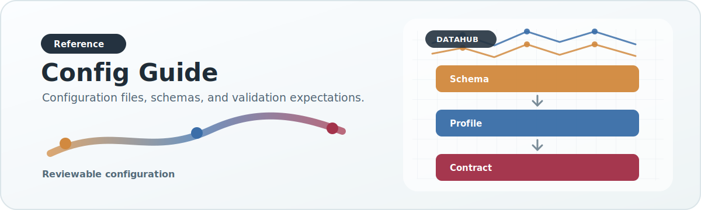

# Config Guide

{ .doc-visual }

## `config/prep_profiles/`

Defines raw-column arbitration for legacy/raw association sources.

Typical contents:

- field candidate columns
- ancestry field mapping
- defaults

## `config/profiles/`

Defines dataset/modality validation policy.

Typical contents:

- required fields
- missing-value strategy
- unknown-value handling

## `config/sources/`

Defines source metadata and adapter defaults.

Typical contents:

- source identity
- adapter name
- modalities and dataset types
- access metadata
- default parameters
- `integration_status`, either `integrated` or `catalog_only`

`integrated` sources have a registered DataHub connector/adapter and can be
used by ingestion flows. `catalog_only` sources are curated backlog entries:
they document priority, modality, URLs, and provenance tags, but they are not
yet ingestible without a new adapter.

## `config/runtime_profiles/`

Defines execution behavior for environments.

Typical contents:

- path defaults
- CPU/memory/thread defaults
- scheduler and Slurm settings
- step-specific command settings

## `config/export_manifests/`

Defines analyzed export behavior.

Typical contents:

- promoted fields
- metadata preservation rules
- helper-driven derived fields
- additive publish fields
- serving preservation rules
- source overrides

## `config/schemas/`

Defines JSON Schemas for the config families above.

Current schemas cover:

- source manifests
- dataset profiles
- preparation profiles
- runtime profile catalogs
- association export manifests and source overrides
- output contracts
- secondary-analysis manifests

Validate the default tree with:

```bash
python -c "from datahub.config_schemas import validate_default_config_tree, format_config_validation_issues; issues = validate_default_config_tree(); print(format_config_validation_issues(issues) if issues else 'config ok')"
```

## `config/phenotype_tree.json`

Defines canonical phenotype hierarchy.

This file influences:

- disease / trait grouping
- filter hierarchy
- canonical path reconstruction
- rollup logic

## Which config should I change?

- Raw column issue: `prep_profiles`
- Validation issue: `profiles`
- Source identity / defaults issue: `sources`
- Environment execution issue: `runtime_profiles`
- Published analyzed field issue: `export_manifests`
- Hierarchy / grouping issue: `phenotype_tree.json`
