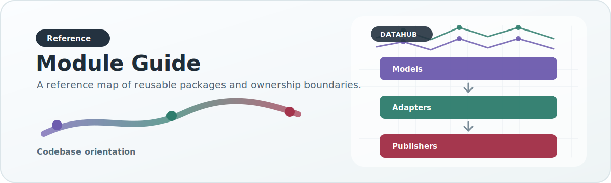

# Module Guide

{ .doc-visual }

This page explains the purpose and design philosophy of each major `src/datahub/` area.

## `models.py`

Defines the core canonical record shape.

**Philosophy:** keep the shared model compact, stable, and reusable; push source-specific extras into metadata until promotion is justified.

## `config.py` and `profiles.py`

Define field policies and validation contracts.

**Philosophy:** data quality expectations should be explicit, declarative, and testable.

## `config_schemas.py`

Validates repository JSON config against schemas in `config/schemas/`.

**Philosophy:** malformed config should fail before ingestion, publication, or
HPC submission begins.

## `prep/`

Handles raw preparation for irregular association sources.

**Philosophy:** normalize ugly raw inputs early, but do not let raw preparation become the place where final analyzed semantics are decided.

## `adapters/`

Map source-specific inputs into canonical records.

**Philosophy:** source-specific parsing belongs here, not in publishers and not in the backend.

## `sources/`

Contains source manifest definitions and the source registry.

**Philosophy:** source identity and onboarding metadata should be first-class, separate from the code that parses records.

## `registry.py`

Adapter plugin registry.

**Philosophy:** community and future source expansion should not require rewriting core orchestration code.

## `quality.py`

Contract validation.

**Philosophy:** bad records should be rejected or repaired by explicit policy, not by accidental downstream assumptions.

## `enrichment.py`

Holds enrichment and source-priority concepts.

**Philosophy:** cross-source arbitration should be explicit and central, not duplicated in scattered scripts.

## `storage/`

Canonical storage backends.

**Philosophy:** keep working analytical storage queryable and reproducible.

## `unified/`

Shared helpers for unified DuckDB operational workflows.

**Philosophy:** runtime behavior such as DuckDB temp directories and memory
settings should be centralized, while CLI scripts remain orchestration shells.

## `artifact_qa.py`

Release QA report helpers.

**Philosophy:** artifact handoffs should include machine-readable counts,
checksums, and source-catalog status rather than relying on ad hoc notes.

## `publishers/`

Create analyzed artifacts.

**Philosophy:** publication is the boundary where canonical data becomes consumer-facing shape. It must preserve meaning, compatibility, provenance, and explicit scientific counting semantics.

For association payloads this includes:

- counting category axes at unique `variant_id` granularity
- selecting a representative record per variant when duplicates survive upstream
- avoiding row-batch merge behavior that changes final chart meaning

## `axis_normalization.py`

Normalizes chart axes such as clinical significance.

**Philosophy:** categorical semantics must be normalized centrally so chart contracts remain coherent.

This module is responsible for keeping semantically equivalent labels from fragmenting chart categories, for example:

- `indel` vs `INDEL`
- case variants of most severe consequence labels
- list-like clinical significance payloads that should reduce to one canonical category

## `phenotype_paths.py`

Resolves canonical phenotype hierarchy paths.

**Philosophy:** hierarchy is part of the scientific contract, not just a UI concern.

## `ancestry.py`

Handles ancestry normalization and source ancestry preservation.

**Philosophy:** preserve raw/source ancestry identity when possible; do not collapse early unless the platform has explicitly chosen to do so.

## `export_manifest.py` and `export_helpers.py`

Manifest-driven preservation/derivation layer.

**Philosophy:** analyzed export semantics should be explicit, configurable, and testable instead of hidden inside ad hoc publisher code.

## `secondary_analyses/`

Secondary-analysis generation and serving-update support.

**Philosophy:** imported modalities and derived post-association analyses should share one explicit extension layer instead of becoming one-off builder flags or backend hacks.

This package is responsible for:

- manifest-driven secondary-analysis registration
- artifact generation for imported and derived analyses
- in-place updates to an existing serving DuckDB

Current analyses:

- `expression` as an imported secondary analysis
- `sga` as a derived post-association analysis

## `pipeline.py`

High-level pipeline composition.

**Philosophy:** compose adapters, contracts, storage, and publishers as reusable building blocks rather than one monolithic dataset script.
