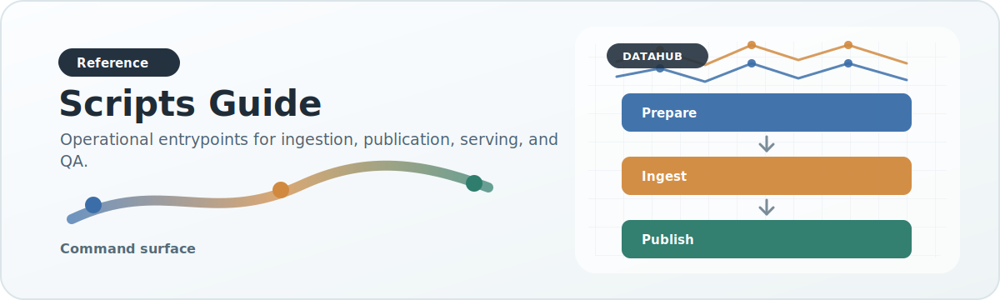

# Scripts Guide

{ .doc-visual }

## General entrypoints

Editable installs expose console commands for the main entrypoints. For
example, `datahub-run-ingestion` is the console-command equivalent of
`scripts/run_ingestion.py`.

### `scripts/prepare_association_raw.py`

Prepare irregular raw association inputs using a prep profile.

Use this when:

- the source has unstable columns or inconsistent raw formatting
- you need an auditable intermediate CSV before canonical ingest

### `scripts/build_legacy_association.py`

Build legacy-compatible association outputs from the modular pipeline.

Use this when:

- you want a simpler association-only pipeline path
- you are not using the full unified DuckDB-first workflow

### `scripts/run_ingestion.py`

Run configurable source-driven ingestion.

Use this when:

- you want a config-driven adapter/source/publisher pipeline
- you are exercising the more general modular ingestion surface

### `scripts/run_structural_variant_ingestion.py`

Run streaming dbVar structural-variant publication through DataHub.

Use this when:

- you need the legacy `structural_variants.json` artifact
- the source file is large enough that the generic in-memory pipeline is the wrong tool
- you want dbVar parsing, Ensembl enrichment, validation, and publication to live in DataHub instead of DataManager

Important contract/config split:

- output shape comes from `config/output_contracts/structural_variant_legacy.json`
- gene metadata reuse is a separate seed input
- merge behavior is a separate existing-output concern
- local gene overlap can come from a pinned GTF, with Ensembl overlap fallback disabled by default for speed
- resume uses a row-level checkpoint plus periodic output snapshots, so reruns can continue from the last saved raw-row boundary

Recommended repository-local invocation:

```bash
python scripts/run_structural_variant_ingestion.py \
  --input raw_data/dbvar/dbvar_structural_variants_nstd229.csv.zip \
  --gene-annotation-gtf raw_data/gencode.v49.annotation.gtf.gz \
  --output-json analyzed_data/dbvar/dbvar_structural_variants_nstd229.json.zip \
  --gene-metadata-seed analyzed_data/dbvar/dbvar_structural_variants_nstd102_seed.json.zip \
  --merge-source-json analyzed_data/dbvar/dbvar_structural_variants_nstd102_seed.json.zip \
  --merge-existing \
  --report-path analyzed_data/dbvar/dbvar_structural_variants_nstd229.report.json \
  --cache-path analyzed_data/dbvar/dbvar_structural_variant_ensembl_cache.json \
  --checkpoint-every-rows 50000 \
  --progress-every 5000
```

### `scripts/report_artifact_qa.py`

Build a JSON release QA report for published outputs and DuckDB artifacts.

Use this when:

- you need row counts and checksums for a DataHub release
- you want to verify source-catalog integration status alongside artifacts
- you want a compact handoff report after building the serving DB

Example:

```bash
datahub-report-artifact-qa \
  --published-root /data/hbp/analyzed_data_unified \
  --working-db-path /data/hbp/datamart/mvp_fast.duckdb \
  --serving-db-path /data/hbp/datamart/association_serving.duckdb \
  --output-json /data/hbp/state/datahub_qa_report.json
```

Resume notes:

- checkpoint defaults to `analyzed_data/dbvar/dbvar_structural_variants_nstd229.json.checkpoint.json`
- use `--output-json ...json.zip` for reusable checked-in artifacts; DataHub reads and writes single-file JSON zip artifacts directly
- rerun the same command to continue from the latest saved checkpoint
- use `--reset-checkpoint` to force a clean restart
- use `--no-resume` to ignore checkpoint state for a one-off fresh run
- if you add `--skip-row-count`, progress percent is intentionally unavailable because the total row count is not precomputed
- add `--enable-ensembl-overlap-fallback` only if you want no-hit rows double-checked against Ensembl

### `scripts/enrich_structural_variant_exons.py`

Backfill missing canonical transcript exon arrays in a legacy structural variant
artifact using Ensembl `lookup/id?expand=1`. Use this after a large dbVar run
when local GTF metadata supplied gene/transcript spans but not full exon
structure for newly added genes.

Default behavior is conservative:

- genes whose `canonical_transcript[0].Exon` already exists are skipped, so the
  older Ensembl-seeded genes are left alone
- genes are looked up by their existing Ensembl transcript ID
- the output shape stays compatible with the legacy backend/frontend contract

Single-job enrichment:

```bash
python scripts/enrich_structural_variant_exons.py \
  --input-json analyzed_data/dbvar/dbvar_structural_variants_nstd229.json.zip \
  --output-json analyzed_data/dbvar/dbvar_structural_variants_nstd229.exons.json.zip \
  --cache-path analyzed_data/dbvar/dbvar_structural_variant_exon_ensembl_cache.json \
  --report-path analyzed_data/dbvar/dbvar_structural_variants_nstd229.exons.report.json \
  --progress-every 100 \
  --log-level INFO
```

Partitioned HPC-safe fetch/apply mode:

```bash
python scripts/enrich_structural_variant_exons.py \
  --input-json analyzed_data/dbvar/dbvar_structural_variants_nstd229.json.zip \
  --patch-output-json /N/scratch/kvand/hbp/sv_exon_patches/nstd229_p00.json \
  --cache-path /N/scratch/kvand/hbp/cache/sv_exon_ensembl_p00.json \
  --sleep-seconds 0.25 \
  --unit-partitions 32 \
  --unit-partition-index 0

python scripts/enrich_structural_variant_exons.py \
  --input-json analyzed_data/dbvar/dbvar_structural_variants_nstd229.json.zip \
  --output-json analyzed_data/dbvar/dbvar_structural_variants_nstd229.exons.json.zip \
  --patch-input-json /N/scratch/kvand/hbp/sv_exon_patches/nstd229_p*.json
```

For array jobs, keep `--sleep-seconds` nonzero so parallel partitions do not
hit Ensembl in the same burst. The shared API client also retries `429 Too Many
Requests` responses using `Retry-After` when Ensembl provides it.

## MVP scripts

### `scripts/dataset_specific_scripts/mvp/ingest_mvp_duckdb_fast.py`

Fast, resumable MVP ingest into DuckDB points.

Direct use defaults DuckDB temp spill files to `<db-dir>/_duckdb_tmp` so laptop
and test runs do not require `/data`. Runtime profiles can still pass a
production scratch path through `paths.temp_directory`.

### `scripts/dataset_specific_scripts/mvp/run_mvp_pipeline.py`

MVP-specific end-to-end pipeline including legacy-compatible publication.

### `scripts/dataset_specific_scripts/mvp/export_mvp_prepared_raw.py`

Export prepared raw MVP rows for audit or downstream merge workflows.

## Unified scripts

### `scripts/dataset_specific_scripts/unified/ingest_legacy_raw_duckdb.py`

Ingest legacy raw CVD/trait files into the shared DuckDB points table.

### `scripts/dataset_specific_scripts/unified/manage_working_duckdb.py`

Manage the first concrete implementation of the target DataHub lifecycle model inside a working DuckDB.

Use this when:

- you want to initialize the lifecycle tables in a working DuckDB
- you want to register a source-native raw release and inventory its source columns
- you want schema drift reports before running analysis
- you want to load prepared association CSVs into `source_normalized_association`
- you want to materialize `analysis_ready_association` from the current points table during migration

Subcommands:

- `init`
  - creates `raw_release_registry`, `raw_file_inventory`, `schema_drift_reports`, `source_normalized_association`, and `analysis_ready_association`
- `register-raw-release`
  - inventories raw files, stores ordered columns and schema fingerprints, and writes a drift verdict
  - when `--prep-profile` is provided, field-candidate aliases are treated as alternatives rather than requiring every alias column to exist
- `load-source-normalized-association`
  - loads a prepared association CSV into the source-normalized zone
- `materialize-analysis-ready-association`
  - materializes the current `mvp_association_points` table into the analysis-ready zone for migration/audit

Example:

```bash
python3 scripts/dataset_specific_scripts/unified/manage_working_duckdb.py init \
  --db-path /data/hbp/datamart/datahub_working.duckdb

python3 scripts/dataset_specific_scripts/unified/manage_working_duckdb.py register-raw-release \
  --db-path /data/hbp/datamart/datahub_working.duckdb \
  --source-id legacy_cvd_raw \
  --release-id legacy_v1 \
  --modality association \
  --input-path "/path/to/legacy_raw/cvd/*.txt" \
  --prep-profile legacy_cvd_raw \
  --skip-checksum \
  --fail-on-breaking-drift
```

### `scripts/dataset_specific_scripts/unified/publish_unified_from_duckdb.py`

Publish legacy-compatible analyzed outputs from unified DuckDB points, with checkpointing and partition support.

Important operational flags:

- `--preflight-validate-units N`
  - validates the first `N` staged units before the rest of the run continues
- `--publisher-mode all`
  - publishes association, overall, variant index, and rollups unless disabled
- `--publisher-mode variant-index-only`
  - backfills only `association/final/variant_index` using a separate default
    checkpoint namespace, so existing completed association checkpoints do not
    cause the backfill to skip every unit
  - streams variant-index JSON arrays to disk as canonical records are produced,
    so very large genes do not have to be held in Python memory before writing
- `--variant-index-query-mode grouped`
  - default for variant-index backfills; uses grouped source-priority collapse
    instead of a `row_number()` window over each giant shard
- `--disable-variant-index`
  - emergency compatibility flag for old consumers that do not want the
    filterable variant-index artifacts
- `--unit-partitions` / `--unit-partition-index`
  - deterministic parallel publish partitioning
- `--reset-checkpoint`
  - clear resume state before a fresh rerun

### `scripts/dataset_specific_scripts/unified/build_association_serving_duckdb.py`

Build a compact serving DuckDB from published outputs.

The builder writes both compatibility payload tables and API-shaped summary
tables:

- `association_gene_payloads` / `overall_gene_payloads`
  - full published payloads used for detail views and compatibility
- `association_summary_payloads` / `overall_summary_payloads`
  - lightweight chart-summary payloads used by `/api/search_summary/`

### `scripts/dataset_specific_scripts/unified/upgrade_association_serving_duckdb.py`

Add summary tables to an existing serving DuckDB in place.

Use this when:

- the full association pipeline has already finished
- a production serving DB already exists and is too large to copy or rebuild
- `/api/search_summary/` must stop reading giant full `payload_json` blobs

Example:

```bash
python3 scripts/dataset_specific_scripts/unified/upgrade_association_serving_duckdb.py \
  --db-path /data/DataHub/datamart/association_serving.duckdb \
  --batch-size 1 \
  --payload-source auto \
  --progress-interval 100 \
  --slow-payload-seconds 30 \
  --log-level INFO
```

The command is incremental. If interrupted, rerun it without
`--replace-summary-tables` and it will skip summary rows that already exist.
Use `--max-rows 10` for a quick smoke test before allowing the full run to
continue.

Payload source modes:

- `auto`: prefer the recorded `source_path` JSON/JSON.GZ files and fall back to
  DuckDB `payload_json`
- `source-path`: require source files and fail fast if any payload file is
  missing
- `duckdb`: read payloads only from the existing serving DB

`auto` is the recommended mode for Big Red upgrades because reading each full
payload back from a 400+ GB DuckDB VARCHAR column can be much slower than
streaming the original published JSON.GZ files.

For Big Red 200 / Slurm runs, use the bundled batch script. It processes
partition shards sequentially in one job because DuckDB should not have
multiple concurrent writers to the same database file:

```bash
cd /geode2/home/u050/kvand/BigRed200/DataHub

sbatch --export=ALL,DATAHUB_ROOT=/geode2/home/u050/kvand/BigRed200/DataHub,DB_PATH=/N/scratch/kvand/hbp/datamart/association_serving.duckdb,UNIT_PARTITIONS=16,BATCH_SIZE=1,PAYLOAD_SOURCE=auto,DUCKDB_MEMORY_LIMIT=120GB,DUCKDB_TEMP_DIRECTORY=/N/scratch/kvand/hbp/datamart/duckdb_tmp \
  scripts/slurm/upgrade_association_serving_duckdb.sbatch
```

Do not run the partitions as parallel Slurm array tasks against the same
DuckDB file. DuckDB is a single-writer database; parallel writers can contend
or fail. Use `UNIT_PARTITIONS` for restartable sequential chunks, not
concurrent writes.

### `scripts/dataset_specific_scripts/unified/run_secondary_analyses.py`

Generate or apply secondary-analysis artifacts.

Use this when:

- you want to derive `sga` from the cleaned unified association DuckDB
- you want to normalize `expression` into the standard secondary-analysis artifact layout
- you want to update an existing serving DuckDB with secondary analyses without rebuilding association tables

Operational note:

- the `sga` generator is designed for HPC-style runs and streams the unified association table gene-by-gene to avoid loading the full deduplicated working set into Python memory
- for large production SGA runs, use `--unit-partitions` and `--unit-partition-index` to split work across deterministic gene shards; clear the output once before submission rather than using `--replace` inside parallel jobs
- use `--duckdb-memory-limit` and `--duckdb-temp-directory` on HPC so large distinct/order phases can spill to scratch rather than being killed for exceeding Slurm memory

Subcommands:

- `generate`
  - create per-gene secondary artifacts under `final/<analysis>/genes/`
- `apply`
  - load those artifacts into an existing serving DB and refresh `gene_catalog`
  - logs file-read/insert progress every `--progress-interval` artifacts so long AWS/HPC updates do not appear stalled
  - runs the table replacement and catalog refresh in one transaction so failed applies roll back cleanly

### `scripts/dataset_specific_scripts/unified/run_unified_pipeline.py`

Profile-driven orchestration for the unified pipeline across laptop/AWS/HPC.

`--step all` runs `working_init`, `mvp_ingest`, `legacy_ingest`, and `publish`.
The `working_init` step initializes the target lifecycle tables in the working
DuckDB before the current points-table ingest/publish stages run.

## Script philosophy

The scripts directory is intentionally operational. Business/scientific logic should live in `src/datahub/` when it can. Scripts should compose that logic and add environment/runtime concerns such as CLI parsing, checkpoints, and scheduler integration.
