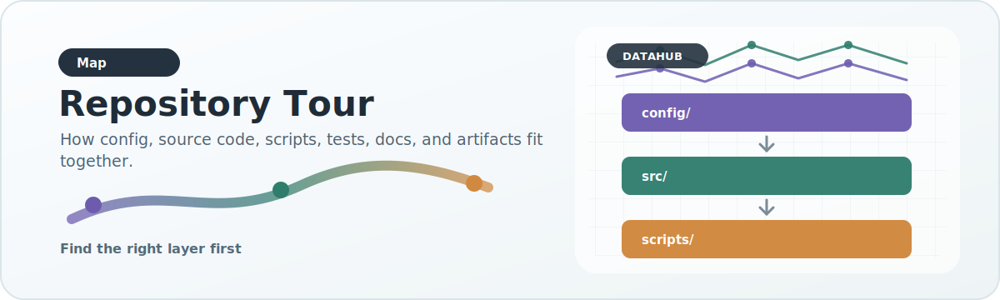

# Repository Tour

{ .doc-visual }

This page is the practical map of the repository.

## Top-level structure

```text
DataHub/
  config/
  docs/
  scripts/
  src/datahub/
  tests/
  config/schemas/
  pyproject.toml
  README.md
  requirements.txt
  requirements-docs.txt
  mkdocs.yml
```

## `config/`

This directory is the declarative heart of the repository.

### Main subdirectories

- `config/prep_profiles/`: how raw legacy columns are mapped into prepared intermediate columns
- `config/profiles/`: dataset-type validation contracts
- `config/sources/`: source manifests and metadata for onboarded or catalogued sources
- `config/runtime_profiles/`: execution profiles for laptop/AWS/HPC orchestration
- `config/export_manifests/`: analyzed export rules for preservation and derivation between unified data and published artifacts
- `config/schemas/`: JSON Schemas used to validate config families before runs
- `config/phenotype_tree.json`: canonical phenotype hierarchy used for grouping and path resolution

## `src/datahub/`

This is the reusable library layer.

### Packages and modules

- `models.py`: canonical in-memory record model
- `config.py`: field policies and contract primitives
- `profiles.py`: loader for dataset validation profiles
- `prep/`: raw preparation profiles and preparers
- `adapters/`: source-specific canonical record readers
- `sources/`: source manifests and source registry
- `registry.py`: adapter plugin registry
- `quality.py`: validation against dataset contracts
- `enrichment.py`: enrichment and source-priority logic hooks
- `storage/`: canonical storage backends such as DuckDB + Parquet
- `publishers/`: analyzed artifact emitters
- `axis_normalization.py`: normalization for categorical axes used in charts
- `phenotype_paths.py`: phenotype hierarchy resolution
- `ancestry.py`: ancestry normalization and provenance helpers
- `export_manifest.py`, `export_helpers.py`: manifest-driven preservation/derivation layer between unified data and analyzed outputs
- `pipeline.py`: high-level orchestration for adapter -> validate -> storage -> publish
- `config_schemas.py`: JSON Schema validation helpers for repository config
- `artifact_qa.py`: release QA summaries for source catalog, published outputs, and DuckDB artifacts
- `unified/`: shared runtime helpers used by unified DuckDB operational scripts

## `scripts/`

These are operational entrypoints.

### General scripts

- `build_legacy_association.py`
- `prepare_association_raw.py`
- `run_ingestion.py`
- `report_artifact_qa.py`

### Dataset-specific operational flows

- `scripts/dataset_specific_scripts/mvp/`
- `scripts/dataset_specific_scripts/unified/`

These are where practical large-scale workflows live today.

## `tests/`

Tests are intentionally focused on behavior, not just coverage. They include:

- adapter correctness
- preparation correctness
- source manifest loading
- publisher behavior
- serving builder behavior
- unified pipeline behavior
- export manifest behavior

## How to navigate the repo efficiently

If you are making a change, identify the layer first.

- New raw-column mapping problem: `config/prep_profiles/` or `src/datahub/prep/`
- New source or source-specific parse logic: `config/sources/` plus `src/datahub/adapters/`
- New validation rule: `config/profiles/` or `src/datahub/config.py`
- New analyzed payload field: `config/export_manifests/` plus publisher/build logic
- Runtime environment issue: `config/runtime_profiles/` or orchestration scripts
- Config validation issue: `config/schemas/` plus `src/datahub/config_schemas.py`
- Release verification issue: `src/datahub/artifact_qa.py` or `scripts/report_artifact_qa.py`
