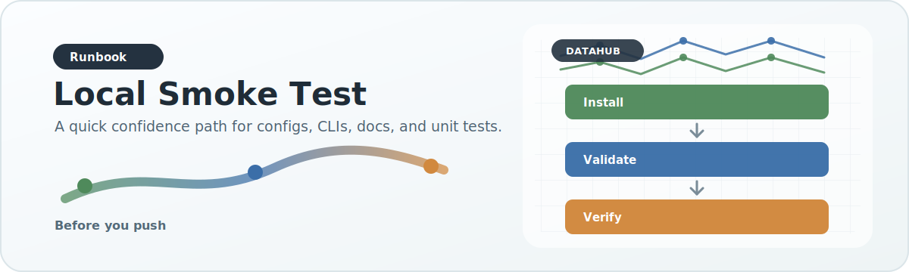

# Local Smoke Test

{ .doc-visual }

Use this runbook when you want to verify a fresh checkout or a small local
change without running a production-sized pipeline.

## 1. Create the environment

```bash
python3 -m venv .venv
source .venv/bin/activate
pip install --upgrade pip
pip install -e ".[test,docs]"
```

## 2. Validate config

```bash
python -c "from datahub.config_schemas import validate_default_config_tree, format_config_validation_issues; issues = validate_default_config_tree(); print(format_config_validation_issues(issues) if issues else 'config ok')"
```

## 3. Run tests

```bash
python -m pytest -q
```

## 4. Dry-run the unified profile runner

```bash
datahub-run-unified-pipeline \
  --profile local_laptop \
  --step publish \
  --dry-run \
  --log-level INFO
```

This confirms profile parsing, environment expansion, interpreter resolution,
and command generation without touching production data.

## 5. Check docs

```bash
mkdocs build --strict
```

## Notes

- Direct DuckDB-heavy commands spill to `<db-dir>/_duckdb_tmp` by default.
- Production profiles should set `paths.temp_directory` to scratch storage.
- Use `sys.executable` in subprocess tests so test subprocesses stay inside the
  same virtual environment as `python -m pytest`.
