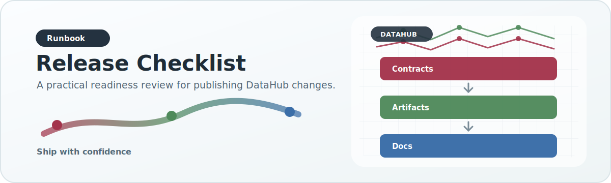

# Release Checklist

{ .doc-visual }

Use this checklist before handing DataHub artifacts to the backend or copying
them between HPC, AWS, and production-serving environments.

## Before the run

- Confirm the runtime profile points to the intended raw inputs, working DB,
  output root, state root, and scratch temp directory.
- Validate config with `validate_default_config_tree`.
- Record source release IDs and any schema drift expectations.
- Clear output/state only when starting an intentional fresh release.

## Run order

The standard profile-driven order is:

1. `working_init`
2. `mvp_ingest`
3. `legacy_ingest`
4. `publish`
5. serving DuckDB build
6. optional secondary-analysis apply
7. artifact QA report

For the first four stages:

```bash
datahub-run-unified-pipeline --profile PROFILE_NAME --step all --log-level INFO
```

## Serving build

```bash
datahub-build-serving-duckdb \
  --input-root /path/to/analyzed_data_unified \
  --db-path /path/to/association_serving.duckdb \
  --qa-report-json /path/to/association_serving.qa.json
```

The serving DB must preserve the published artifact contract declared in
`config/output_contracts/association_serving_duckdb.json`.

## QA report

```bash
datahub-report-artifact-qa \
  --published-root /path/to/analyzed_data_unified \
  --working-db-path /path/to/working.duckdb \
  --serving-db-path /path/to/association_serving.duckdb \
  --output-json /path/to/datahub_qa_report.json
```

Review:

- source catalog integrated vs catalog-only counts
- published payload counts by payload family and dataset type
- sample payload checksums
- working DuckDB table counts
- serving DuckDB table counts and checksum

## Handoff

- Include the runtime profile name and git commit.
- Include the export manifest ID/version from serving `build_metadata`.
- Include the QA report JSON.
- Note any intentional schema drift, skipped sources, or partial dataset filters.
