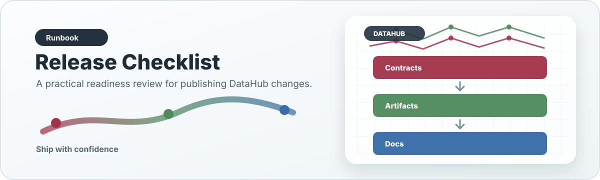

# Release Checklist

{ .doc-visual }

Use this checklist before handing DataHub artifacts to the backend or copying
them between HPC, AWS, and production-serving environments.

## Before the run

- Confirm the runtime profile points to the intended raw inputs, working DB,
  output root, state root, and scratch temp directory.
- Validate config with `validate_default_config_tree`.
- Record source release IDs and any schema drift expectations.
- Clear output/state only when starting an intentional fresh release.

## Run order

The standard profile-driven order is:

1. `working_init`
2. `mvp_ingest`
3. `legacy_ingest`
4. `publish`
5. serving DuckDB build
6. optional Variant Viewer canonicalization
7. optional dbSNP frequency index build
8. optional secondary-analysis generation/apply
9. artifact QA report

For the first four stages:

```bash
datahub-run-unified-pipeline --profile PROFILE_NAME --step all --log-level INFO
```

## Serving build

```bash
datahub-build-serving-duckdb \
  --input-root /path/to/analyzed_data_unified \
  --db-path /path/to/association_serving.duckdb \
  --qa-report-json /path/to/association_serving.qa.json
```

The serving DB must preserve the published artifact contract declared in
`config/output_contracts/association_serving_duckdb.json`.

## Variant Viewer cleanup

If `analyzed_data/variant_viewer` is part of the release, run the canonicalizer
before backend handoff:

```bash
python scripts/dataset_specific_scripts/unified/canonicalize_variant_viewer_artifacts.py \
  --variant-viewer-root analyzed_data/variant_viewer \
  --phenotype-tree-json config/phenotype_tree.json \
  --raw-root raw_data \
  --dry-run \
  --remove-hidden-raw \
  --fail-on-unknown \
  --reset-checkpoint
```

The dry-run should have no unknown phenotype dirs or row labels. Apply with
`--backup-root analyzed_data/backups`, then rerun the dry-run. The final dry-run
should report zero remaining moves, rewrites, drops, and hidden raw files.

## dbSNP frequency index

If new dbSNP frequency archive batches are included, build or refresh the
population-frequency DuckDB index:

```bash
python scripts/dataset_specific_scripts/unified/build_dbsnp_frequency_index.py \
  --raw-root raw_data/dbsnp \
  --output-db datamart/dbsnp_frequency.duckdb \
  --legacy-dbsnp-root analyzed_data/dbSNP \
  --include-legacy \
  --verbose
```

Keep the checkpoint JSON with run logs, but do not commit generated DuckDB,
checkpoint, raw archive, or analyzed artifact files.

## Secondary analyses

Generate secondary artifacts before applying them to the serving DB. Current
secondary-analysis manifests are:

- `expression`
- `sga`
- `protein_context`
- `gene_profile`

For gene profile, run the one-command pipeline after protein-context artifacts
exist if they should be folded into dossier payloads:

```bash
python scripts/dataset_specific_scripts/unified/run_gene_profile_pipeline.py \
  --raw-root raw_data \
  --output-root secondary_analyses \
  --release RELEASE_ID \
  --protein-context-root secondary_analyses/final/protein_context
```

When serving HBP, make sure the backend environment points
`HBP_GENE_PROFILE_PATH` at `secondary_analyses/final/gene_profile/v1`.

## QA report

```bash
datahub-report-artifact-qa \
  --published-root /path/to/analyzed_data_unified \
  --working-db-path /path/to/working.duckdb \
  --serving-db-path /path/to/association_serving.duckdb \
  --output-json /path/to/datahub_qa_report.json
```

Review:

- source catalog integrated vs catalog-only counts
- published payload counts by payload family and dataset type
- sample payload checksums
- working DuckDB table counts
- serving DuckDB table counts and checksum

## Handoff

- Include the runtime profile name and git commit.
- Include the export manifest ID/version from serving `build_metadata`.
- Include the QA report JSON.
- Note any intentional schema drift, skipped sources, or partial dataset filters.
